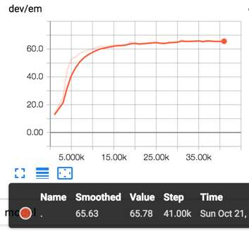
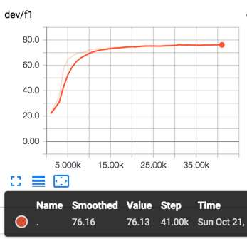
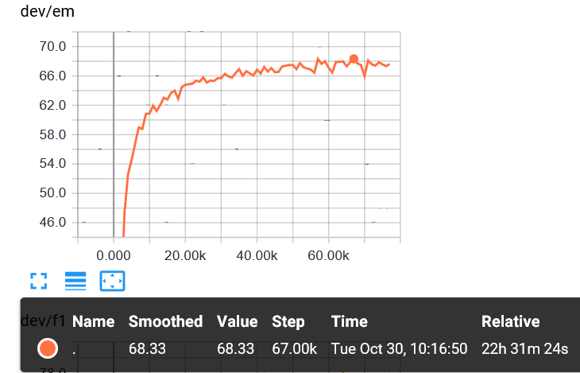
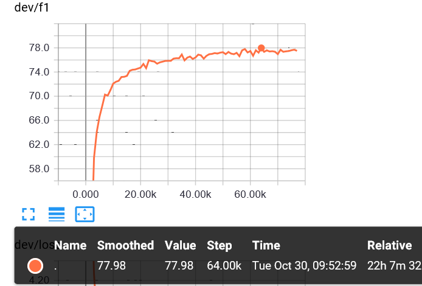

# QAnetEstimator
 QAnetEstimator is an implementation of Google's QANet using TensorFlow's estimator API. It has been proven to have excellent performance.
 
## overview
 QAnetEstimator is a TensorFlow implementation of Google's [QANet](https://openreview.net/pdf?id=B14TlG-RW), inspired by the work done by [nlplearn](https://github.com/NLPLearn/QANet) . While some implementation details were taken from their work, this version is a complete rewrite using TensorFlow's estimator API, dataset API, and layers API. These APIs make the code more concise and clear.
 
 Furthermore, additional processing has been done on padding to ensure that the padding data does not affect the normal input data in the neural network. This has resulted in higher F1 and EM scores compared to nlplearn's version.
 
 
## Requirements
  * Python>=3.5
  * TensorFlow>=1.10
   
## Usage
    I use a parameter to switch models (there is a bidaf flow model inside) 
    --procedure "wordembedding","QAnetEmbedding","dcn","QaModelBlock","QAOutput" 
    using this procedure, a qanet is built.
     
## todo
   add elmo to replace embedding layer
   
## Result
The dataset used for this task is [Stanford Question Answering Dataset](https://rajpurkar.github.io/SQuAD-explorer/)
I did not use it directly, but copy my network to nlplearn's qanet, you can see the replacement in [my fork version](https://github.com/linsu07/QANet)
，and the comparison of result is shown below

    nlplearn's em 
   
    
    nlplearn's f1
   
   
    my version's em
   
   
    my version's f1
   
   